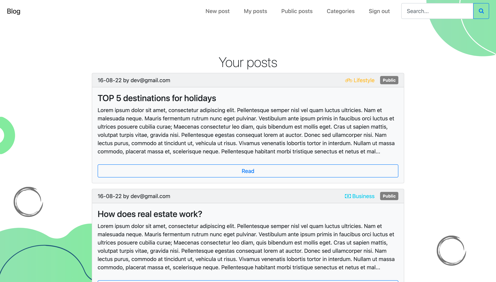
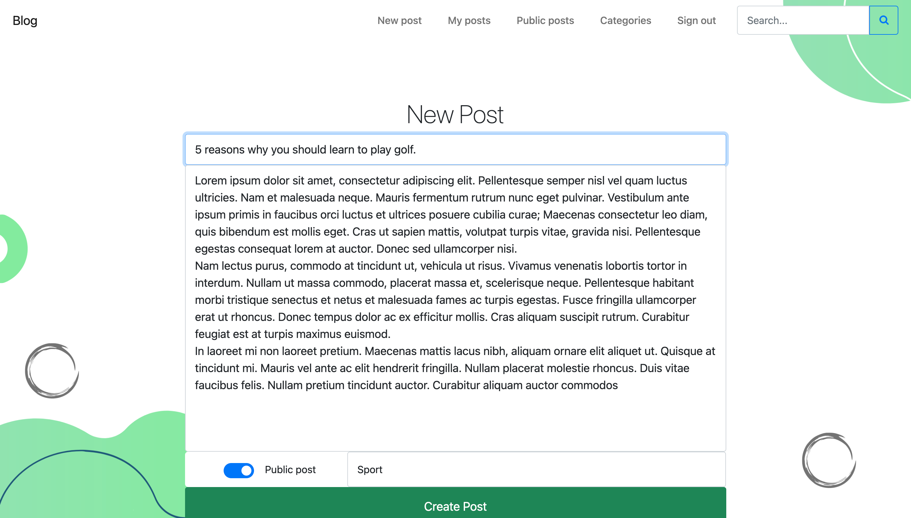

# ✳️ Blog Project

Blog application made for educational purpose to learn basic features of Ruby On Rails. You can play with it live [here](https://misty-sky-9144.fly.dev/). Most of the functions are available for registered users. To make it simpler you can use the following account: <br>

Email: user@gmail.com <br>
Password: qwerty

# Screenshots
 
 
 

## 🙌 Features

- Users can register, create posts and share them or keep them private
- Posts might have its categories. You can see them in the 'Categories' tab
- You can read your posts and public posts of other users
- You can edit and delete only your posts
- The website uses pagination
- Use search bar to search posts by the content of their title, body or author
- 👇 When you edit or create a new post, async validation system lets you know about errors in real time


## 🛠 Technologies
- HTML
- CSS
- Bootstrap
- JS
- Ruby on Rails
- PostgreSQL

## 👉 Launching
Install gems:
```
bundle install
```
Migrate the database:
```
rails db:migrate
```
Seed the database:
```
rails db:seed
```
Run the application:
```
rails s
```

## 🚨 Tests

To run tests:
```
rspec
```
