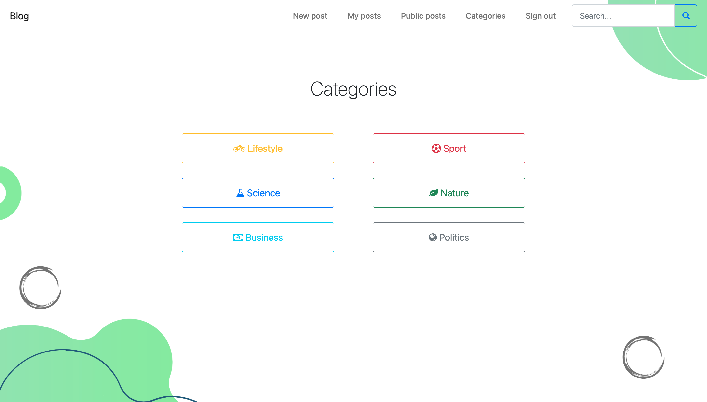

# README

Blog application where you can register, create posts and share them or keep them private. You can read through your posts and public posts of other users.

It is made for educational purpose to learn basic features of Ruby On Rails.

You can watch it live on [Heroku](https://vast-beach-21113.herokuapp.com/). Most of the functions are available for registered users, thus consider creating an account.

# Technologies
- HTML
- CSS
- Bootstrap
- Ruby on Rails
- PostgreSQL

# Screenshots
 
 
 
